# 🌟 Hey there! I'm **Vipul Paswan** 

<div align="center">
  
[](https://git.io/typing-svg)


</div>

<div align="center">
  

[](https://github.com/vipulpaswan)
[](https://github.com/vipulpaswan)

</div>

---

## 🎯 **About Me**

🎓 **Final-year B.Tech (CSE - Data Science)** student at **KCC Institute of Technology & Management**  
🌟 Currently in **7th Semester** with a passion for turning complex problems into elegant solutions  
🚀 **Problem Solver** | **ML Enthusiast** | **Full Stack Developer**  
🌍 Based in **India 🇮🇳**  

**🎯 Current Focus Areas:**
- 🤖 Advanced Machine Learning & AI
- 🧩 Data Structures & Algorithms  
- 🌐 Flask Web Development
- 📊 Database Management with SQL
- 🔓 Open Source Contributions

**💭 Philosophy:** *"Code is not just about solving problems — it's about solving them beautifully ✨"*

---

## 🛠️ **Tech Arsenal**

<div align="center">

### **Languages**


### **Web Technologies**


### **Data Science & ML**


### **Databases & Tools**


</div>

---

## 🚀 **Featured Projects**

<div align="center">

| 🎯 **Project** | 📝 **Description** | 🛠️ **Tech Stack** |
|:---|:---|:---|
| **🎭 Attendance Management System** | Face recognition-based attendance tracking with OpenCV | Python, OpenCV, Flask, SQLite |
| **🚛 Shipment Price Prediction** | ML model to predict shipping costs using regression algorithms | Python, scikit-learn, Pandas, Flask |
| **🧠 AI Doubt Solver** | Conceptual AI-powered student assistance platform | Python, Flask, ML Algorithms |

</div>

---

## 📊 **GitHub Analytics**

<div align="center">
  


</div>

<div align="center">
  


</div>

---

## 🎖️ **Achievements & Highlights**

<div align="center">

[](https://github.com/vipulpaswan)

</div>

**🔥 Key Strengths:**
- 🧩 **Problem Solving** - Regular practice on LeetCode and competitive programming
- 🤖 **Machine Learning** - Hands-on experience with classification, regression, and computer vision
- 🌐 **Full Stack Development** - End-to-end web application development
- 📊 **Data Analysis** - Proficient in data preprocessing, feature engineering, and visualization
- 🔧 **Database Management** - SQL query optimization and database design

---

## 🌟 **Current Focus & Learning**

```mermaid
mindmap
  root((🎯 Learning Journey))
    🤖 Advanced ML
      🧠 Deep Learning
      🔗 Neural Networks
      👁️ Computer Vision
    🧩 Problem Solving
      📊 Data Structures
      ⚡ Algorithms
      🏆 Competitive Programming
    🌐 Web Development
      🐍 Flask Applications
      🔌 REST APIs
      🗄️ Database Integration
    📈 Career Growth
      🌟 Open Source
      💼 Industry Projects
      ✍️ Technical Writing
```

<div align="center">



</div>

---

## 📈 **Weekly Development Breakdown**

```text
Python       ████████████████████▌   82.5%
SQL          ████████▌               34.2%
JavaScript   ██████▌                 26.8%
HTML/CSS     ████▌                   18.3%
Java         ███▌                    14.7%
```

---

## 🤝 **Let's Connect & Collaborate**

<div align="center">

[](https://www.linkedin.com/in/vipulpaswan/)
[](mailto:vipulpaswan95@gmail.com)
[](https://github.com/vipulpaswan)
[](https://github.com/vipulpaswan)

</div>

---

## 💭 **Random Dev Quote**

<div align="center">


</div>

---

<div align="center">
  
</div>

---

<div align="center">

### ⭐ **"Building Tomorrow's Solutions with Today's Code"** ⭐


</div>

**🔥 Fun Fact:** I believe every bug is just a feature waiting to be understood! 🐛➡️✨
